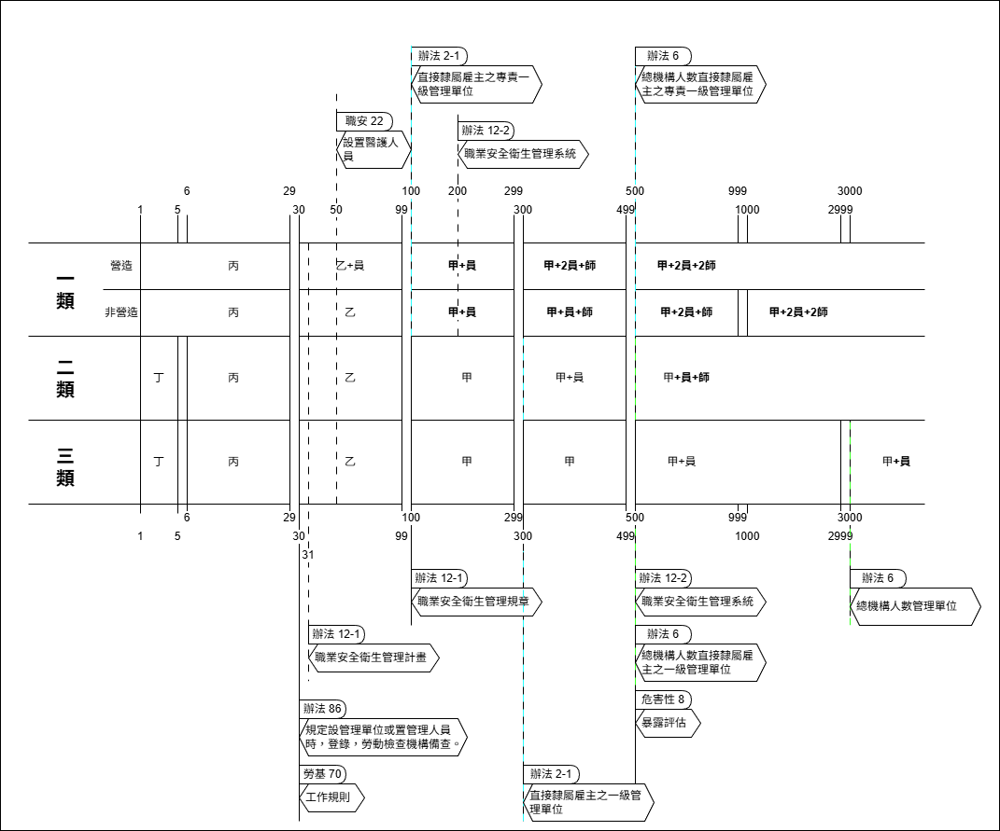
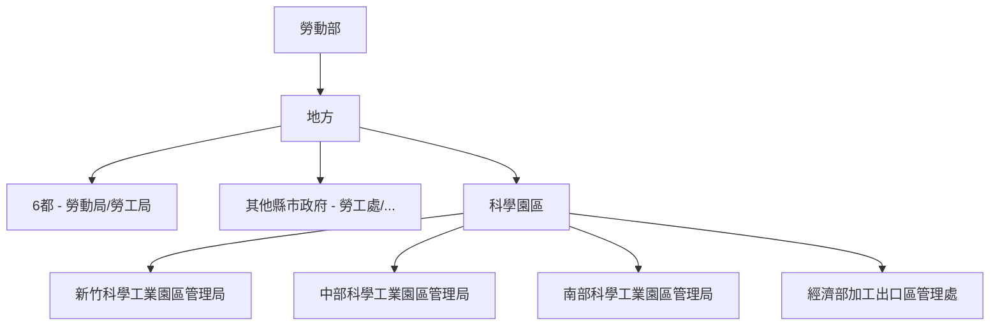

# 安全衛生組織

細則 第 32 條

本法第二十三條第一項所定安全衛生組織，包括下列組織：

1. `職業安全衛生管理單位`：為事業單位內擬訂、規劃、推動及督導職業安全衛生有關業務之組織。
2. `職業安全衛生委員會`：為事業單位內審議、協調及建議職業安全衛生有關業務之組織。

## 職業安全衛生管理單位

### 人數規定

> [管理辦法 第 2-1 條](https://law.moj.gov.tw/LawClass/LawSingle.aspx?pcode=N0060027&flno=2-1)

-   第一類 **≥100 人**：設**專責一級**管理單位（直隸雇主）。
-   第二類 **≥300 人**：設一級管理單位（直隸雇主）。
-   第三類：免設。

> [管理辦法 第 6 條](https://law.moj.gov.tw/LawClass/LawSingle.aspx?pcode=N0060027&flno=6)

設有總機構之事業

1. 第一類 **≥500 人**：設**專責一級**管理單位。
2. 第二類 **≥500 人**：設**一級**管理單位。
3. 第三類 **≥3000 人**：設管理單位。

前述管理人員**專職**；但第二、三類之**職業安全衛生業務主管**不在此限。

-   職業安全衛生管理規章：不需「報備」；但 100 人以上如以管理規章作為組織及人員替代方案，須向職安署申請核定其內容。

### 報備

> [管理辦法 第 8 條 第 2 項](https://law.moj.gov.tw/LawClass/LawSingle.aspx?pcode=N0060027&flno=8)

勞工人數在 `30 人以上`之事業單位，其職業安全衛生人員離職時，應即報當地勞動檢查機構備查。

> [管理辦法 第 86 條](https://law.moj.gov.tw/LawClass/LawSingle.aspx?pcode=N0060027&flno=86)

勞工人數在 `30 人以上`之事業單位，依第二條之一至第三條之一、第六條規定設管理單位或置管理人員時，應依中央主管機關公告之內容及方式**登錄**，陳報勞動檢查機構**備查**。

### 替代方案

> [管理辦法 第 89-1 條](https://law.moj.gov.tw/LawClass/LawSingle.aspx?pcode=N0060027&flno=89-1)

`政府機關（構）`，對於第二條之一(管理單位)、第三條(管理人員)及第六條(總機構管理單位)之規定，因其他法規限制，得於組織修編完成前，以`報經`中央主管機關核定之`職業安全衛生管理規章或職業安全衛生管理計畫`替代之。

### 績效認可

> [管理辦法 第 6-1 條](https://law.moj.gov.tw/LawClass/LawSingle.aspx?pcode=N0060027&flno=6-1)

通過職安管理系統績效認可者(CNS 45001 同等以上規定)，得免「專責一級」之要求。

## 職業安全衛生管理系統

> [管理辦法 第 12-2 條](https://law.moj.gov.tw/LawClass/LawSingle.aspx?pcode=N0060027&flno=12-2)

下列事業單位，雇主應依國家標準 CNS 45001 同等以上規定，建置適合該事業單位之職業安全衛生管理系統，並據以執行：

1. 第一類事業勞工人數在 `200人` **以上**者。
2. 第二類事業勞工人數在 `500人` **以上**者。
3. 有從事石油裂解之石化工業工作場所者。
4. 有從事製造、處置或使用危害性之化學品，數量達中央主管機關規定量以上之工作場所者。

前項安全衛生管理之執行，應作成紀錄，並保存三年。

## **業務主管訓練時數（小時）**

| 類別     | 一般業 丁 | 一般業 丙 | 一般業 乙 | 一般業 甲 | 營造 丙 | 營造 乙 | 營造 甲 | 職安員 |
| -------- | --------: | --------: | --------: | --------: | ------: | ------: | ------: | -----: |
| 訓練時數 |         6 |        21 |        35 |        42 |      26 |      35 |      42 |    115 |

## 職業安全衛生管理計畫

> [管理辦法 第 12-1 條 第 1 項](https://law.moj.gov.tw/LawClass/LawSingle.aspx?pcode=N0060027&flno=12-1)

-   雇主應依其事業單位之規模、性質，訂定職業安全衛生管理計畫，要求各級主管及負責指揮、監督之有關人員執行；
-   勞工人數在 `30人`**以下**之事業單位，得以安全衛生管理執行紀錄或文件代替職業安全衛生管理計畫。

-   第一項職業安全衛生管理事項之執行，應作成紀錄，並保存三年。

## 職業安全衛生管理規章

> [管理辦法 第 12-1 條 第 2 項](https://law.moj.gov.tw/LawClass/LawSingle.aspx?pcode=N0060027&flno=12-1)

勞工人數在 `100人`**以上**之事業單位，應另訂定職業安全衛生管理規章。

## 各縣市勞工行政主管機關

