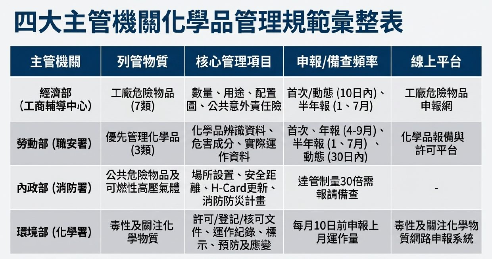

# 通報/備查

[TOC]

## 通報

-   **作業環境監測**: 雇主對於前項監測計畫及監測結果，應公開揭示，並**通報**中央主管機關。中央主管機關或勞動檢查機構得實施查核。

    (職業安全衛生法 第 12 條)

## 備查

-   **設管理單位或置管理人員**: 勞工人數在三十人以上之事業單位，依第二條之一至第三條之一、第六條規定設管理單位或置管理人員時，應依中央主管機關公告之內容及方式**登錄**，陳報勞動檢查機構**備查**。

    ( 職業安全衛生管理辦法 第 86 條)

-   **職業安全衛生人員離職**: 勞工人數在 `30 人以上`之事業單位，其職業安全衛生人員離職時，應即報當地勞動檢查機構**備查**。

    (管理辦法 第 8 條 第 2 項)

## 四大主管機關化學品管理規範彙整表 ([Ref](https://www.facebook.com/photo.php?fbid=1505753851552995&set=a.125153089613085&type=3&mibextid=wwXIfr&rdid=ONxk9OGePN4Xvgrq&share_url=https%3A%2F%2Fwww.facebook.com%2Fshare%2F1G6vzhkeVW%2F%3Fmibextid%3DwwXIfr#))

