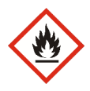
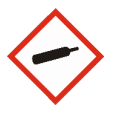
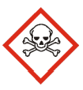
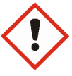
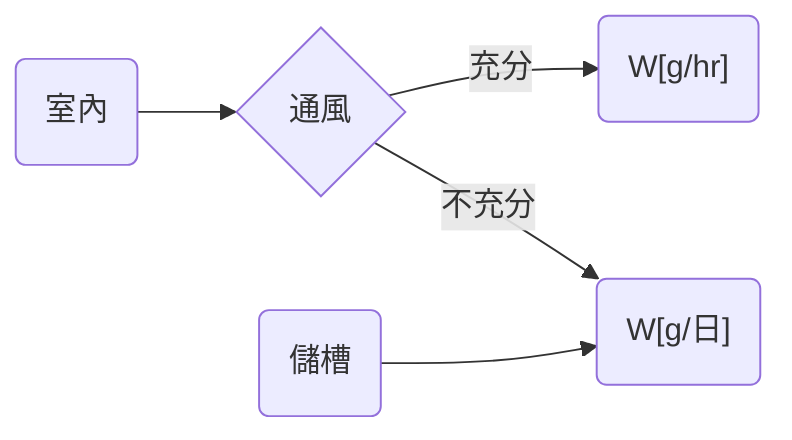

# 化學品 - 總集


## 危害性化學品/管制性化學品/優先管理化學品/環境監測/特定化學物質

|                |                            |                                                                                                                                                                                                      |
| -------------- | -------------------------- | ---------------------------------------------------------------------------------------------------------------------------------------------------------------------------------------------------- |
| 危害性化學品   | 職 10.3                    | CNS15030 具有危害性之化學品（以下簡稱危害性化學品）                                                                                                                                                  |
| 管制性化學品   | 職 14.3；細 19             | 優先管理化學品中，經中央主管機關評估具高度暴露風險者                                                                                                                                                 |
| 優先管理化學品 | 職 29.1.3；職 30.1.5       | 未滿十八歲者、妊娠 <br>CNS 15030（一）致癌物質、生殖細胞致突變性物質、生殖毒性物質。（二）呼吸道過敏物質第一級。（三）嚴重損傷或刺激眼睛物質第一級。（四）特定標的器官系統毒性物質屬重複暴露第一級。 |
| 特定化學物質   | 特定化學物質危害預防標準 2 |                                                                                                                                                                                                      |
| 特定管理物質   | 特定化學物質危害預防標準 3 |                                                                                                                                                                                                      |

## 管制性化學品 (細 19)

- 對於未滿十八歲及妊娠或分娩後未滿一年女性勞工具危害性之化學品

  |                                                  | 未滿 <br>(職 29.1.3) | 妊娠或分娩後未滿一年女性<br>(職 30.1.5) |
  | ------------------------------------------------ | :------------------: | :-------------------------------------: |
  | 黃磷                                             |          V           |                                         |
  | 氯氣                                             |          V           |                                         |
  | 氰化氫                                           |          V           |                                         |
  | 苯胺                                             |          V           |                                         |
  | 鉛及其無機化合物                                 |          V           |                                         |
  | 六價鉻化合物                                     |          V           |                                         |
  | 汞及其無機化合物                                 |          V           |                    V                    |
  | 砷及其無機化合物                                 |          V           |                    V                    |
  | 二硫化碳                                         |                      |                    V                    |
  | 三氯乙烯                                         |                      |                    V                    |
  | 環氧乙烷                                         |                      |                    V                    |
  | 丙烯醯胺                                         |                      |                    V                    |
  | 次乙亞胺                                         |                      |                    V                    |
  | 含有 1 至 13 列舉物占其重量超過`1/100`之混合物。 |                      |                                         |
  | 其他經中央主管機關指定公告者。                   |                      |                                         |

- CNS15030 分類，屬致癌物質第一級、生殖細胞致突變性物質第一級或生殖毒性物質第一級者。
- CNS15030 分類，具有物理性危害或健康危害，其化學品運作量達中央主管機關規定者。

## 甲乙丙丁種特定化學物質

雇主不得使勞工從事製造、處置或使用甲類物質。但供試驗或研究者，不在此限。(特定化學物質危害預防標準 (民國 110 年 09 月 16 日修正))

| 特定化學物質 | 內容                       |
| ------------ | -------------------------- |
| 甲類物質     | 12/管制性/黃磷火柴與致癌物 |
| 乙類物質     | 6/致癌或疑似致癌           |
| 丙類物質一   | 27                         |
| 丙類物質二   | 2/奧黃與苯胺紅             |
| 丙類物質三   | 15                         |
| 丁類物質     | 9/易腐蝕                   |

## 特定管理物質

本標準所稱特定管理物質，指下列規定之物質：
一、二氯聯苯胺及其鹽類、α-萘胺及其鹽類、鄰-二甲基聯苯胺及其鹽類、二甲氧基聯苯胺及其鹽類、次乙亞胺、氯乙烯、3,3-二氯-4,4-二胺基苯化甲烷、四羰化鎳、對-二甲胺基偶氮苯、β-丙內酯、環氧乙烷、奧黃、苯胺紅、石綿（不含青石綿、褐石綿）、鉻酸及其鹽類、砷及其化合物、鎳及其化合物、重鉻酸及其鹽類、1,3-丁二烯及甲醛（含各該列舉物佔其重量超過百分之一之混合物）。
二、鈹及其化合物、含鈹及其化合物之重量比超過 1% 或鈹合金含鈹之重量比超過 3% 之混合物（以下簡稱鈹等）。
三、三氯甲苯或其重量比超過 0.5% 之混合物。
四、苯或其體積比超過 1% 之混合物。
五、煤焦油或其重量比超過 5% 之混合物。

## 危害性化學品之分類、標示要項

### 下列物品不適用本規則(4)

1. 事業廢棄物。
2. 菸草或菸草製品。
3. 食品、飲料、藥物、化粧品。
4. 製成品。
   > 日光燈管、溫度計
5. 非工業用途之一般民生消費商品。
6. 滅火器。
7. 在反應槽或製程中正進行化學反應之中間產物。
8. 其他經中央主管機關指定者。

### 物理性危害

|  |                                                       |  |
| -------------------------------------------------------- | -------------------------------------------------------------------------------------------------- | -------------------------------------------------------- |
| 爆炸物                                                   | 易燃氣體<br>易燃氣膠<br>易燃液體<br>易燃固體<br>發火性液體<br>發火性固體<br>自熱物質<br>禁水性物質 | 氧化性氣體<br>氧化性液體<br>氧化性固體                   |

|  |   |  |
| -------------------------------------------------------- | ------------------------------------------------------------------------------------------------------ | -------------------------------------------------------- |
| 加壓氣體                                                 | 自反應物質、有機過氧化物                                                                               | 金屬腐蝕物                                               |

### 健康危害

|   |   |
| ----------------------------------------------------------------------------------------------------------------- | ----------------------------------------------------------------------------------------------------------------- |
| 急毒性物質：吞食<br>急毒性物質：皮膚<br>急毒性物質：吸入                                                          | 腐蝕／刺激皮膚物質<br>嚴重損傷／刺激眼睛物質                                                                      |

|                                                                  |  |   |
| ------------------------------------------------------------------------------------------------------------------------ | -------------------------------------------------------- | ----------------------------------------------------------------------------------------------------------------- |
| 呼吸道過敏物質<br>生殖細胞致突變性物質<br>致癌物質<br>生殖毒性物質<br>特定標的器官系統毒性物質－重複暴露<br>入性危害物質 | 皮膚過敏物質                                             | 特定標的器官系統毒性物質－單一暴露                                                                                |

### 暴露評估

雇主使勞工製造、處置或使用之化學品，符合國家標準 CNS15030 化學品分類，具有健康危害者，應評估其危害及暴露程度，劃分風險等級，並採取對應之分級管理措施。

事業單位從事特別危害健康作業之勞工人數在 100 人以上，或總勞工人數 500 人以上者，雇主應依有科學根據之之採樣分析方法或運用定量推估模式，實施暴露評估。
雇主應就前項暴露評估結果，依下列規定，定期實施評估：

| 暴露濃度 | < 1/2 PEL | <= 1/2 PEL & < PEL | >= PEL                                   |
| -------- | --------- | ------------------ | ---------------------------------------- |
| 評估頻率 | 3 年      | 1 年               | 3 月                                     |
| 分級     | 1 級      | 2 級               | 3 級                                     |
| 措施     | 適當管理  | 採許必要改善措施   | 採取更以效控制措施，確保暴露濃度低於 PEL |

游離輻射作業不適用前二項規定。
化學品之種類、操作程序或製程條件變更，有增加暴露風險之虞者，應於變更前或變更後 3 個月內，重新實施暴露評估。

> PEL 容許暴露限值 (Permissible Exposure Limit)

## 化學品標示(5)

|                                                  | 100 ml                                               |
| ------------------------------------------------ | ---------------------------------------------------- |
| 一、危害圖式。                                   | 一、危害圖式。                                       |
| 二、內容：                                       | 二、內容：                                           |
| （一）名稱。                                     | （一）名稱。                                         |
| （二）危害成分。                                 | ~~（二）危害成分。~~                                 |
| （三）警示語。                                   | （三）警示語。                                       |
| （四）危害警告訊息。                             | ~~（四）危害警告訊息。~~                             |
| （五）危害防範措施。                             | ~~（五）危害防範措施。~~                             |
| （六）製造者、輸入者或供應者之名稱、地址及電話。 | ~~（六）製造者、輸入者或供應者之名稱、地址及電話。~~ |

## SDS 安全資料表應列內容項目說明

|     |                    |                                                                                                                                                                                                                                               |
| --- | ------------------ | --------------------------------------------------------------------------------------------------------------------------------------------------------------------------------------------------------------------------------------------- |
| 1   | 化學品與廠商資料   | 化學品名稱、其他名稱、建議用途及限制使用、製造者、輸入者或供應者名稱、地址及電話、緊急聯絡電話/傳真電話。                                                                                                                                     |
| 2   | 危害辨識資料       | 化學品危害分類、標示內容、其他危害。                                                                                                                                                                                                          |
| 3   | 成分辨識資料       | 純物質：中英文名稱、同義名稱、化學文摘社登記號碼（CAS No.)、危害成分（成分百分比)。<br> 混合物：化學性質、危害成分之中英文名稱、化學文摘社登記號碼（CAS No.）、濃度或濃度範圍（成分百分比）。註：危害成分確無化學文摘社登記號碼者，得免列之。 |
| 4   | 急救措施           | 不同暴露途徑之急救方法、最重要症狀及危害效應、對急救人員之防護、對醫師之提示。                                                                                                                                                                |
| 5   | 滅火措施           | 適用滅火劑、滅火時可能遭遇之特殊危害、特殊滅火程序、消防人員之特殊防護設備。                                                                                                                                                                  |
| 6   | 洩漏處理方法       | 個人應注意事項、環境注意事項、清理方法。                                                                                                                                                                                                      |
| 7   | 安全處置與儲存方法 | 處置、儲存。                                                                                                                                                                                                                                  |
| 8   | 暴露預防措施       | 工程控制、控制參數、個人防護設備、衛生措施。                                                                                                                                                                                                  |
| 9   | 物理及化學性質     | 外觀（物質狀態、顏色）、氣味、嗅覺閾值、pH 值、熔點、沸點/沸點範圍、易燃性（固體、氣體）、分解溫度、閃火點、自燃溫度、爆炸界限、蒸氣壓、蒸氣密度、密度、溶解度、辛醇／水分配係數（log Kow）、揮發速率。                                       |
| 10  | 安定性及反應性     | 安定性、特殊狀況下可能之危害反應、應避免之狀況、應避免之物質、危害分解物。                                                                                                                                                                    |
| 11  | 毒性資料           | 暴露途徑、症狀、急毒性、慢毒性或長期毒性。                                                                                                                                                                                                    |
| 12  | 生態資料           | 生態毒性、持久性及降解性、生物蓄積性、土壤中之流動性、其他不良效應。                                                                                                                                                                          |
| 13  | 廢棄處置方法       | 廢棄處置方法。                                                                                                                                                                                                                                |
| 14  | 運送資料           | 聯合國編號、聯合國運輸名稱、運輸危害分類、包裝類別、海洋污染物（是／否）、特殊運送方法及注意事項。                                                                                                                                            |
| 15  | 法規資料           | 適用法規。                                                                                                                                                                                                                                    |
| 16  | 其他資料           | 參考文獻、製表單位、製表人、製表日期。                                                                                                                                                                                                        |

```Text
CAS No.
是美國化學文摘社（CAS）為每種化學物質分配的唯一數字識別碼，以解決化學物質擁有多種名稱的困擾，方便資料庫檢索。
log Kow.
辛醇／水分配係數（log Kow）衡量化合物疏水性（親油性）的重要指標
```

```Text
1. 前項安全資料表所用文字以中文為主，必要時並輔以作業勞工所能瞭解之外文。
2. 混和物
   - 混合物已作整體測試者，依整體測試結果。
   - 混合物未作整體測試者，其健康危害性，除有科學資料佐證外，依國家標準 CNS15030 分類之混合物分類標準；對於燃燒、爆炸及反應性等物理性危害，使用有科學根據之資料評估。
3. 安全資料表內容之正確性，適時更新，並至少每 `3` 年檢討一次。
4. 安全資料表更新之內容、日期、版次等更新紀錄，應保存 `3` 年。
5. 營業秘密之必要，而保留揭示安全資料表中之危害性化學品成分之名稱、化學文摘社登記號碼、含量或製造者、輸入者或供應者名稱。
   檢附下列文件，向中央主管機關申請核定：
   1. 認定為國家安全或商品營業秘密之證明。
   2. 為保護國家安全或商品營業秘密所採取之對策。
   3. 對申請者及其競爭者之經濟利益評估。
   4. 該商品中危害性化學品成分之危害性分類說明及證明。
   前項申請檢附之文件不齊全者，申請者應於收受中央主管機關補正通知後 `30` 日內補正，補正次數以 `2` 次為限；逾期未補正者，不予受理。
```

## 新化學物質

|              | 科學研發 | 產品與製程研發 | 限定廠址中間產物 | 聚合物   | 低密度聚合物 |
| ------------ | -------- | -------------- | ---------------- | -------- | ------------ |
| <1T          | X        | 少量登記       | 少量登記         | 少量登記 | X            |
| 1T <= & <10T | 簡易登記 | 簡易登記       | 簡易登記         | 簡易登記 | 少量登記     |
| 10T <=       | 標準登記 | 標準登記       | 標準登記         | 標準登記 | 少量登記     |

## 有機溶劑

### 一二三種有機溶劑

第一種有機溶劑(第一種 危害最大)(有機溶劑中毒預防規則)：四氯化碳

| 有機溶劑或其混合物 |                                                                       |
| ------------------ | --------------------------------------------------------------------- |
| 第一種             | 三氯甲烷、四氯乙烷、四氯化碳、二氯乙烯、二氯乙烷、二硫化碳丶 三氯乙烯 |
| 第二種             | 41 種                                                                 |
| 第三種             | 汽油、煤焦油精、石油醚、石油精、輕油精、松節油、礦油精                |

所以請整理完可以大概念如下

- 第一種－氯/硫 系列，共 7 種
- 第三種－與油有關系列，汽油，石油等等

#### 容許消費量 與 換氣量 計算

其他的都歸類第二種，這樣會比較快速。

| 有機溶劑或其混合物 | 有機溶劑或其混存物之容許消費量 | 換氣量                         |
| ------------------ | ------------------------------ | ------------------------------ |
| 第一種             | $W = \frac{1}{15} \times V$    | $Q[CMM] = 0.3W[\frac{g}{hr}]$  |
| 第二種             | $W = \frac{2}{5} \times V$     | $Q[CMM] = 0.04W[\frac{g}{hr}]$ |
| 第三種             | $W = \frac{3}{2} \times V$     | $Q[CMM] = 0.01W[\frac{g}{hr}]$ |



> W 容許消費量
> V 作業場所之氣積 (H > 4 -> H=4；V > 150 -> V = 150)
> Q 換氣量

#### 通風換氣 / 整體換氣 / 局部排氣選擇


#### 免除裝置設計

1. 室內作業場所或儲槽等之作業場所，從事有關第一種有機溶劑 or 室內作業場所或儲槽等之作業場所，從事有關第二種有機溶劑進行噴布 or 槽等之作業場所或通風不充分之室內作業場所，從事有關第三種有機溶劑進行噴布
   1. 於儲槽等之作業場所或通風不充分之室內作業場所，從事`臨時性`之有機溶劑作業。
   2. 於通風充分之室內作業場所，從事有機溶劑作業，其`作業時間短暫`。
   3. 於經常置備處理有機溶劑作業之反應槽或其他設施`與其他作業場所隔離，且無須勞工常駐室內`。
   4. 於室內作業場所或儲槽等之作業場所之內壁、地板、頂板從事有機溶劑作業，因`有機溶劑蒸氣擴散面之廣泛`不易設第六條第一項第一款或第七條規定之設備。
2. 於儲槽等之作業場所或通風不充分之室內作業場所，從事有機溶劑作業，而從事該作業之勞工已使用`輸氣管面罩`且業時間短暫時，得免除設置密閉設備、局部排氣裝置或整體換氣裝置。
3. 符合下列情形之一時，得免除設置密閉設備、局部排氣裝置或整體換氣裝置：
   1. 從事紅外線乾燥爐或具有溫熱設備等之有機溶劑作業，`如設置有利用溫熱上升氣流之排氣煙囪`等設備，將有機溶劑蒸氣排出作業場所之外，不致使有機溶劑蒸氣擴散於作業場所內者。
   2. 藉水等覆蓋開放槽內之有機溶劑或其混存物，或裝置有效之逆流凝縮機於槽之開口部使有機溶劑蒸氣不致擴散於作業場所內者。
4. 於汽車之車體、飛機之機體、船段之組合體或鋼樑、鋼構等大型物件之外表從事有機溶劑作業時，因有機溶劑蒸氣擴散面之廣泛不易設置第六條第一項或第七條規定之設備，且已設置`吹吸型換氣裝置`時，不受第六條第一項或第七條規定之限制，得免除設置密閉設備、局部排氣裝置或整體換氣裝置。

### 特別危害健康作業

有機溶劑中毒預防規則所稱之下列有機溶劑作業：
(一)1，1，2，2-四氯乙烷。
(二)四氯化碳。
(三)二硫化碳。
(四)三氯乙烯。
(五)四氯乙烯。
(六)二甲基甲醯胺。
(七)正己烷。

---

<div style="page-break-after: always;"></div>


