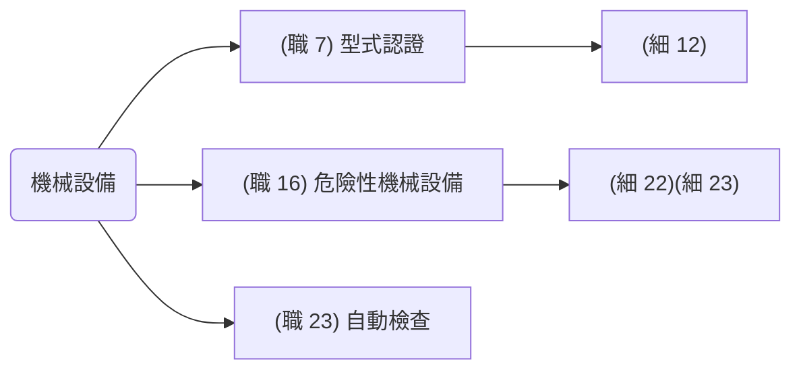
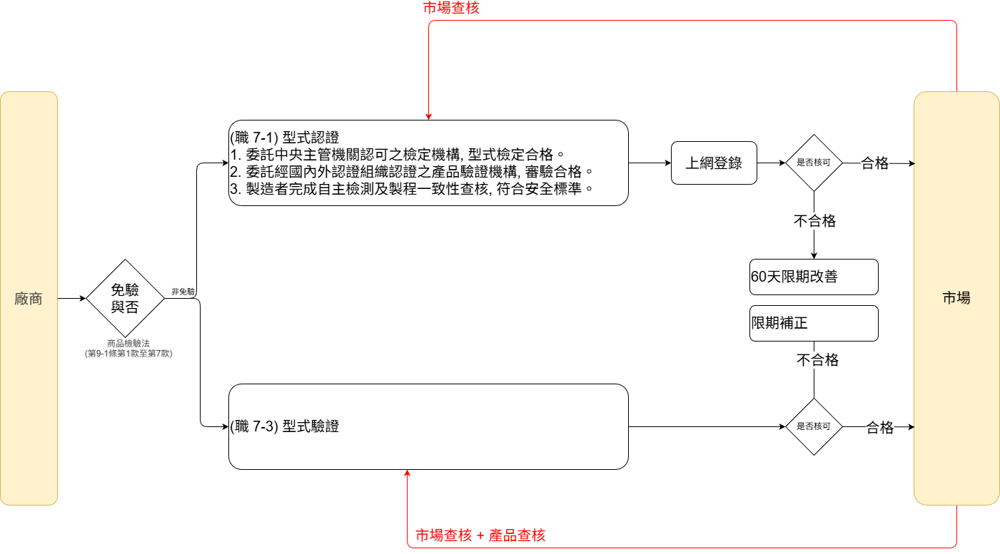

# 機械設備

> [TOC]



## `型式認證` (職 7)(細 12)

-   **製造者、輸入者、供應者或雇主**：非符合安全標準不得產製運出廠場、輸入、租賃、供應或設置。
-   **製造者、輸入者**: 符合前項安全標準者於網站申報。

```text
(細 12)

1. 動力衝剪機械。(經中央主管機關認可之檢定機構實施`型式檢定`合格)
2. 手推刨床。
3. 木材加工用圓盤鋸。(經中央主管機關認可之檢定機構實施`型式檢定`合格)
4. 動力堆高機。
5. 研磨機。(經中央主管機關認可之檢定機構實施`型式檢定`合格)
6. 研磨輪。
7. 防爆電氣設備。(防爆燈具、防爆電動機、防爆開關箱：`型式檢定`)
8. 動力衝剪機械之光電式安全裝置。
9. 手推刨床之刃部接觸預防裝置。
10. 木材加工用圓盤鋸之反撥預防裝置及鋸齒接觸預防裝置。
11. 其他經中央主管機關指定公告者。
```

```text
(機械設備器具安全資訊申報登錄辦法 4)

 1. 委託經中央主管機關認可之檢定機構實施`型式檢定`合格。
 2. 委託經國內外認證組織認證之產品`驗證機構審驗`合格。
 3. 製造者完成自主檢測及產品製程一致性查核, 確認符合安全標準。
```

## `型式驗證` (職 8)(職 9)

-   **製造者、輸入者**: 非型式驗證合格不得產製運出廠場、輸入、租賃、供應或設置。

-   (勞職授字第 10702004912 號公告)
    指定`交流電焊機用自動電擊防止裝置`列入職業安全衛生法第八條第一項之型式驗證設備

-   免驗證
    1. 依第十六條(危險性之機械或設備)或其他法律規定實施檢查、檢驗、驗證或認可。
    2. 供國防軍事用途使用, 並有國防部或其直屬機關出具證明。
    3. 限量製造或輸入僅供科技研發、測試用途之專用機型, 並經中央主管機關核准。
    4. 非供實際使用或作業用途之商業樣品或展覽品, 並經中央主管機關核准。
    5. 其他特殊情形, 有免驗證之必要, 並經中央主管機關核准。

## 危險性機械

(職 16)(細 22)(危險性機械及設備安全檢查規則 3)

| 項目         | 範圍                                                                 |
| ------------ | -------------------------------------------------------------------- |
| 固定式起重機 | 吊升荷重在 **3T** 以上之固定式起重機或 **1T** 以上之斯達卡式起重機。 |
| 移動式起重機 | 吊升荷重在 **3T** 以上之移動式起重機。                               |
| 人字臂起重桿 | 吊升荷重在 **3T** 以上之人字臂起重桿。                               |
| 營建用升降機 | 設置於營建工地, 供營造施工使用之升降機。                             |
| 營建用提升機 | 導軌或升降路高度在 **20** 公尺以上之營建用提升機。                   |
| 吊籠         | 載人用吊籠。                                                         |

### 危險性機械定期檢查等應做的檢查

| 檢查項目     | 型<br>式<br>檢<br>查 | 竣<br>工<br>檢<br>查 | 定<br>期<br>檢<br>查 | 使<br>用<br>檢<br>查 | 變<br>更<br>檢<br>查 | 重<br>新<br>檢<br>查 | 檢<br>查<br>頻<br>率 |
| ------------ | :------------------: | :------------------: | :------------------: | :------------------: | :------------------: | :------------------: | :------------------: |
| 固定式起重機 |          ◯           |          ◯           |          ◯           |                      |          ◯           |          ◯           |         2 年         |
| 移動式起重機 |          ◯           |                      |          ◯           |          ◯           |          ◯           |          ◯           |         2 年         |
| 人字臂起重桿 |          ◯           |          ◯           |          ◯           |                      |          ◯           |          ◯           |         2 年         |
| 營建用提升機 |          ◯           |          ◯           |          ◯           |                      |          ◯           |          ◯           |         2 年         |
| 營建用升降機 |          ◯           |          ◯           |          ◯           |                      |          ◯           |          ◯           |         1 年         |
| 吊籠         |          ◯           |                      |          ◯           |          ◯           |          ◯           |          ◯           |         1 年         |


-   需要施工的才有竣工檢查。
-   無須施工的需有使用檢查。

## 危險性設備

> (職 16)(細 23)([危險性機械及設備安全檢查規則](https://law.moj.gov.tw/LawClass/LawAll.aspx?pcode=N0060039) 4)

`P 壓力、HS 傳熱面積、H 水頭壓力`

| 設備種類         |            | 屬於危險性設備條件                                                                        | 小型 僅需要進行特殊教育訓練                     |
| ---------------- | ---------- | ----------------------------------------------------------------------------------------- | ----------------------------------------------- |
| 鍋爐             | 蒸氣鍋爐   | - $P>1[\frac{kgf}{cm^2}]$ <br> -$HS>1m^2$ <br> - 胴體內徑超過 300cm <br> - 長度超過 600cm | $P≤1[\frac{kgf}{cm^2}]$ <br>且 $0.5m^2≤HS≤1m^2$ |
|                  | 熱水鍋爐   | $H>10m$ 或 $HS>8m^2$ <br> 且液體溫度超過 1 大氣壓之沸點                                   | $P≤1[\frac{kgf}{cm^2}]$ <br>且 $0.5m^2≤HS≤1m^2$ |
|                  | 熱媒鍋爐   | $H>10m$ 或 $HS>8m^2$                                                                      |                                                 |
|                  | 貫流式鍋爐 | $P>10[\frac{kgf}{cm^2}]$ <br>或 $HS>10m^2$                                                | $P>10[\frac{kgf}{cm^2}]$ <br>且 $5m^2≤HS>10m^2$ |
| 第一種壓力容器   |            | $P>1[\frac{kgf}{cm^2}]$ <br>且 $V>0.2m^3$ $P*V>0.2$(內存蒸氣)                             |                                                 |
| 高壓氣體特定設備 |            | 指供高壓氣體之製造設備及其支持構造物, 其 $P*V>0.04$                                       |                                                 |
| 高壓氣體容器     |            | V≥500 公升(灌裝高壓氣體)                                                                  |                                                 |

### 危險性設備定期檢查等應做的檢查

| 檢查項目         | 型<br>式<br>檢<br>查 | 焊<br>接<br>檢<br>查 | 構<br>造<br>檢<br>查 | 竣<br>工<br>檢<br>查 | 定<br>期<br>檢<br>查 | 變<br>更<br>檢<br>查 | 重<br>新<br>檢<br>查 | 檢<br>查<br>頻<br>率 |
| ---------------- | :------------------: | :------------------: | :------------------: | :------------------: | :------------------: | :------------------: | :------------------: | :------------------: |
| 鍋爐             |          ◯           |          ◯           |          ◯           |          ◯           |          ◯           |          ◯           |          ◯           |         1 年         |
| 壓力容器         |          ◯           |          ◯           |          ◯           |          ◯           |          ◯           |          ◯           |          ◯           |         1 年         |
| 高壓氣體特定設備 |          ◯           |          ◯           |          ◯           |          ◯           |          ◯           |          ◯           |          ◯           |         1 年         |
| 高壓氣體容器     |          ◯           |          ◯           |          ◯           |                      |          ◯           |          ◯           |          ◯           |         5 年         |


-   對發電容量二萬瓩以上之發電用第一種壓力容器期限最長以二年為限。
-   高壓氣體容器之定期檢查，自構造檢查合格日起算，未滿 15 年者，每 5 年一次； 15 年以上未滿 20 年者，每 2 年一次；20 年以上者，每年 1 次。

## 中央主管機關指定之機械

(職 7-1)(細則 12)中央主管機關指定之機械、設備或器具如下：

1. `動`力衝剪機械。
2. 手推`刨`床。
3. 木材加工用`圓`盤鋸。
4. 動力堆`高`機。
5. 研`磨`機。
6. 研磨`輪`。
7. 防爆`電`氣設備。
8. 動力衝剪機械之`光`電式安全裝置。
9. 手推刨床之`刃`部接觸預防裝置。
10. 木材加工用圓盤`鋸`之反撥預防裝置及鋸齒接觸預防裝置。
11. 其他經中央主管機關指定公告者。

> 動保圓高磨輪、電光刃具

## 商檢法



## 高壓氣體

`職業安全衛生設施規則 第 18 條`: 高壓氣體定義[^1]

| 種類                                                                              | 表壓力 Pf               | 溫度        |
| --------------------------------------------------------------------------------- | ----------------------- | ----------- |
| 壓縮氣體                                                                          | $P≥ 10 \frac{kg}{cm^2}$ | $ 35℃ $     |
| 壓縮乙炔氣                                                                        | $P≥ 2 \frac{kg}{cm^2} $ | **$ 15℃ $** |
| 液化氣體                                                                          | $P≥ 2 \frac{kg}{cm^2}$  | $ 35℃ $     |
| 液化`氰化氫`、液化`溴甲烷`、液化`環氧乙烷` <br>或其他經中央主管機關指定之液化氣體 | $P≥ 0 \frac{kg}{cm^2}$  | $ 35℃ $     |

## 高壓氣體容器

| 法規                                                                                                                                         | 內容                                                                                                                                                                                                                                                                                                                                                                                                                                                                               |
| -------------------------------------------------------------------------------------------------------------------------------------------- | ---------------------------------------------------------------------------------------------------------------------------------------------------------------------------------------------------------------------------------------------------------------------------------------------------------------------------------------------------------------------------------------------------------------------------------------------------------------------------------- |
| [職業安全衛生法 第 16 條](https://law.moj.gov.tw/LawClass/LawSingle.aspx?pcode=N0060001&flno=16)                                             | 危險性設備非經勞動檢查機構或中央主管機關指定之代行檢查機構檢查合格，不得使用                                                                                                                                                                                                                                                                                                                                                                                                       |
| **危險性設備** 定義 <br> [職業安全衛生法施行細則 第 23 條](https://law.moj.gov.tw/LawClass/LawSingleRela.aspx?PCODE=N0060002&FLNO=23&ty=L)   | 本法第十六條第一項所稱具有危險性之設備，指符合中央主管機關所定一定容量以上之下列設備：<br> 1. 鍋爐。<br> 2. 壓力容器。<br> 3. 高壓氣體特定設備。<br> 4. **高壓氣體容器。**<br> 5. 其他經中央主管機關指定公告具有危險性之設備。                                                                                                                                                                                                                                                     |
| **高壓氣體容器**定義 <br> [危險性機械及設備安全檢查規則 第 4 條](https://law.moj.gov.tw/LawClass/LawSingle.aspx?pcode=N0060039&flno=4)       | 指供灌裝高壓氣體之容器中，相對於地面可移動，其內容積在 500L 以上者。但下列各款容器，不在此限：<br> 1. 於未密閉狀態下使用之容器。 <br> 2. 溫度在 35℃ 時，$P <50 \frac{kg}{cm^2} $以下之空氣壓縮裝置之容器。 <br> 3. 其他經中央主管機關指定者。                                                                                                                                                                                                                                      |
|                                                                                                                                              |                                                                                                                                                                                                                                                                                                                                                                                                                                                                                    |
| **危險性工作場所**定義 <br> [勞動檢查法 第 26 條](https://law.moj.gov.tw/LawClass/LawSingle.aspx?pcode=N0070001&flno=26)                     | 左列危險性工作場所，非經勞動檢查機構審查或檢查合格，事業單位不得使勞工在該場所作業：<br> 1. 從事石油裂解之石化工業之工作場所。<br> 2. 農藥製造工作場所。<br> 3. 爆竹煙火工廠及火藥類製造工作場所。<br> 4. 設置`高壓氣體類壓力容器`或蒸汽鍋爐，其壓力或容量達中央主管機關規定者之工作場所。<br> 5. 製造、處置、使用危險物、有害物之數量達中央主管機關規定數量之工作場所。<br> 6. 中央主管機關會商目的事業主管機關指定之營造工程之工作場所。<br> 7. 其他中央主管機關指定之工作場所。 |
| **高壓氣體類壓力容器**定義 <br> [勞動檢查法施行細則 第 27-1 條](https://law.moj.gov.tw/LawClass/LawSingle.aspx?pcode=N0070004&flno=27-1)     | 高壓氣體類壓力容器**不包括** <br>1. `移動式`製造設備。 <br>2. `非`屬`有毒性或可燃性`高壓氣體之`單座固定式`製造設備。 <br>3. `減壓`設備。 <br>4. `空調設備`及以氟氯烷為冷媒之冷凍機器。                                                                                                                                                                                                                                                                                             |
| 高壓氣體類壓力容器**容量**定義 <br> [勞動檢查法施行細則 第 27-1 條](https://law.moj.gov.tw/LawClass/LawSingle.aspx?pcode=N0070004&flno=27-1) | 高壓氣體類壓力容器一日之冷凍能力在 `150T` 以上或處理能力符合左列規定之一者：<br> 1. $ 1000 [{m^3}]$ 以上之氧氣、有毒性或可燃性高壓氣體。<br> 2. $ 5000 [{m^3}]$ 以上之前款以外之高壓氣體。                                                                                                                                                                                                                                                                                         |

## 蒸氣鍋爐

| 法規                                                                                                                                       | 內容                                                                                                                                                                                                                                                                                                                                                                                                                                                                               |
| ------------------------------------------------------------------------------------------------------------------------------------------ | ---------------------------------------------------------------------------------------------------------------------------------------------------------------------------------------------------------------------------------------------------------------------------------------------------------------------------------------------------------------------------------------------------------------------------------------------------------------------------------- |
| [職業安全衛生法 第 16 條](https://law.moj.gov.tw/LawClass/LawSingle.aspx?pcode=N0060001&flno=16)                                           | 危險性設備非經勞動檢查機構或中央主管機關指定之代行檢查機構檢查合格，不得使用                                                                                                                                                                                                                                                                                                                                                                                                       |
| **危險性設備** 定義 <br> [職業安全衛生法施行細則 第 23 條](https://law.moj.gov.tw/LawClass/LawSingleRela.aspx?PCODE=N0060002&FLNO=23&ty=L) | 本法第十六條第一項所稱具有危險性之設備，指符合中央主管機關所定一定容量以上之下列設備：<br> 1. 鍋爐。<br> 2. 壓力容器。<br> 3. 高壓氣體特定設備。<br> 4. **高壓氣體容器。**<br> 5. 其他經中央主管機關指定公告具有危險性之設備。                                                                                                                                                                                                                                                     |
| **蒸汽鍋爐**定義 <br> [危險性機械及設備安全檢查規則 第 4 條](https://law.moj.gov.tw/LawClass/LawSingle.aspx?pcode=N0060039&flno=4)         | 最高使用壓力（表壓力，以下同）超過 $ 1 [\frac{kgf}{cm^2}]$ ，<br> 或傳熱面積超過 $ 1 [{m^2}]$（...），<br> 或胴體內徑超過 300cm，長度超過 600cm 之蒸汽鍋爐。                                                                                                                                                                                                                                                                                                                       |
|                                                                                                                                            |                                                                                                                                                                                                                                                                                                                                                                                                                                                                                    |
| **危險性工作場所**定義 <br> [勞動檢查法 第 26 條](https://law.moj.gov.tw/LawClass/LawSingle.aspx?pcode=N0070001&flno=26)                   | 左列危險性工作場所，非經勞動檢查機構審查或檢查合格，事業單位不得使勞工在該場所作業：<br> 1. 從事石油裂解之石化工業之工作場所。<br> 2. 農藥製造工作場所。<br> 3. 爆竹煙火工廠及火藥類製造工作場所。<br> 4. 設置高壓氣體類壓力容器或`蒸汽鍋爐`，其壓力或容量達中央主管機關規定者之工作場所。<br> 5. 製造、處置、使用危險物、有害物之數量達中央主管機關規定數量之工作場所。<br> 6. 中央主管機關會商目的事業主管機關指定之營造工程之工作場所。<br> 7. 其他中央主管機關指定之工作場所。 |
| **蒸汽鍋爐**定義 <br> [勞動檢查法施行細則 第 27-1 條](https://law.moj.gov.tw/LawClass/LawSingle.aspx?pcode=N0070004&flno=27-1)             | 所稱蒸汽鍋爐，指以火焰、燃燒氣體或其他高溫氣體加熱於水或熱媒，使`發生超過大氣壓`之壓力蒸汽，供給他用之裝置與其附屬過熱器及節煤器。                                                                                                                                                                                                                                                                                                                                                 |
| 蒸汽鍋爐**容量**定義 <br> [勞動檢查法施行細則 第 28 條](https://law.moj.gov.tw/LawClass/LawSingle.aspx?pcode=N0070004&flno=28)             | 指蒸汽鍋爐之傳熱面積在 $ 500 [{m^2}]$以上                                                                                                                                                                                                                                                                                                                                                                                                                                          |

[^1]:
    [職業安全衛生設施規則 第 18 條](https://laws.mol.gov.tw/FLAW/FLAWDOC01.aspx?id=FL015021&flno=18)

    本規則所稱高壓氣體，係指下列各款：

    1. 在`常用溫度`下，`表壓力`（以下簡稱壓力）達 10kg/cm2 以上之壓縮氣體或溫度在攝氏三十五度時之壓力可達每平方公分十公斤以上之壓縮氣體。但不含壓縮乙炔氣。
    2. 在`常用溫度`下，壓力達每平方公分二公斤以上之壓縮乙炔氣或溫度在攝氏十五度時之壓力可達每平方公分二公斤以上之壓縮乙炔氣。
    3. 在`常用溫度`下，壓力達每平方公分二公斤以上之液化氣體或壓力達每平方公分二公斤時之溫度在攝氏三十五度以下之液化氣體。
    4. 除前款規定者外，溫度在攝氏三十五度時，壓力超過每平方公分零公斤以上之液化氣體中之液化氰化氫、液化溴甲烷、液化環氧乙烷或其他經中央主管機關指定之液化氣體。

    前項高壓氣體不適用於高壓鍋爐及其管內高壓水蒸氣，交通運輸如火車及航空器之高壓氣體、核子反應裝置有關之高壓氣體、及其他經中央主管機關認可不易發生災害之高壓氣體。
