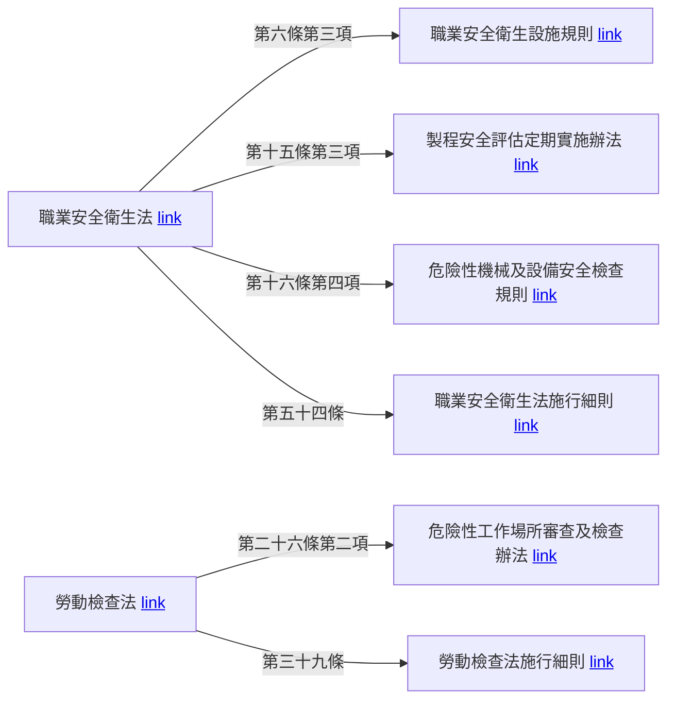

# 法規參考連結

-   [職業安全衛生法](https://law.moj.gov.tw/LawClass/LawAll.aspx?pcode=N0060001)
    -   [職業安全衛生設施規則](https://law.moj.gov.tw/LawClass/LawAll.aspx?pcode=N0060009)
    -   [職業安全衛生法施行細則](https://law.moj.gov.tw/LawClass/LawAll.aspx?pcode=N0060002)
    -   [危險性機械及設備安全檢查規則](https://law.moj.gov.tw/LawClass/LawAll.aspx?pcode=N0060039)
    -   [製程安全評估定期實施辦法](https://law.moj.gov.tw/LawClass/LawAll.aspx?pcode=N0060071)
-   [勞動基準法](https://law.moj.gov.tw/LawClass/LawAll.aspx?pcode=N0030001)
-   [勞動檢查法](https://law.moj.gov.tw/LawClass/LawAll.aspx?pcode=N0060039)
    -   [危險性工作場所審查及檢查辦法](https://law.moj.gov.tw/LawClass/LawAll.aspx?pcode=N0070019)
    -   [勞動檢查法施行細則](https://law.moj.gov.tw/LawClass/LawAll.aspx?pcode=N0070004)

## 法規

### 法規結構

-   母法：有立法目的：立法院三讀通過
-   子法：依母法訂定：中央主管機關各自訂定

<figure markdown="span">
    { width="600" }
</figure>

-   憲法：最高位階, 是國家根本大法。
-   法律：位階僅次於憲法。
-   命令：位階低於法律, 如法規命令、行政規則等。
-   法規命令的名稱常見的有規程、規則、細則、辦法、綱要、標準、準則等。
-   行政規則的位階更低。

## 母法：法、律、條律、通則

1. 勞動基準法
2. 勞工退休金條例
3. 勞工保險條例
4. 就業保險法
5. 工會法
6. 職工福利金條例
7. 職業安全衛生法
8. 勞動檢查法
9. 職業災害勞工保護法
10. 職業訓練法
11. 勞資爭議仲裁辦法
12. 就業服務法
