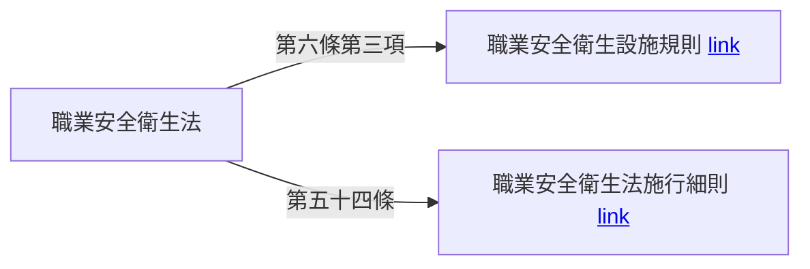
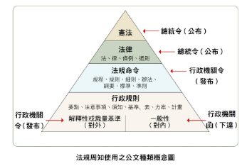

# 法規參考連結

-   [職業安全衛生法](https://law.moj.gov.tw/LawClass/LawAll.aspx?pcode=N0060001&kw=%e8%81%b7%e6%a5%ad%e5%ae%89%e5%85%a8%e8%a1%9b%e7%94%9f%e6%b3%95)
    -   [職業安全衛生設施規則](https://law.moj.gov.tw/LawClass/LawAll.aspx?pcode=N0060009)
    -   [職業安全衛生法施行細則](https://law.moj.gov.tw/LawClass/LawAll.aspx?pcode=N0060002)
-   [勞動基準法](https://law.moj.gov.tw/LawClass/LawAll.aspx?pcode=N0030001&kw=%e5%8b%9e%e5%8b%95%e5%9f%ba%e6%ba%96%e6%b3%95)

## 法規

### 法規結構

-   母法：有立法目的：立法院三讀通過
-   子法：依母法訂定：中央主管機關各自訂定

<figure markdown="span">
    { width="600" }
</figure>

-   憲法：最高位階, 是國家根本大法。
-   法律：位階僅次於憲法。
-   命令：位階低於法律, 如法規命令、行政規則等。
-   法規命令的名稱常見的有規程、規則、細則、辦法、綱要、標準、準則等。
-   行政規則的位階更低。

## 母法：法、律、條律、通則

1. 勞動基準法
2. 勞工退休金條例
3. 勞工保險條例
4. 就業保險法
5. 工會法
6. 職工福利金條例
7. 職業安全衛生法
8. 勞動檢查法
9. 職業災害勞工保護法
10. 職業訓練法
11. 勞資爭議仲裁辦法
12. 就業服務法
