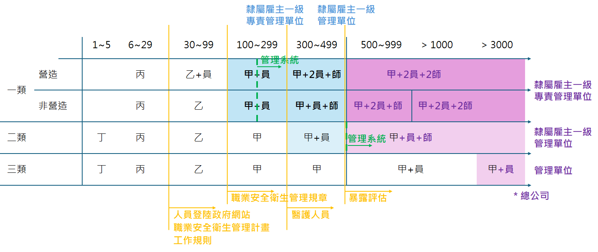

# 職業安全管理單位

> [TOC]

## **業務主管訓練時數（小時）**

| 類別     | 一般業 丁 | 一般業 丙 | 一般業 乙 | 一般業 甲 | 營造 丙 | 營造 乙 | 營造 甲 | 職安員 |
| -------- | --------: | --------: | --------: | --------: | ------: | ------: | ------: | -----: |
| 訓練時數 |         6 |        21 |        35 |        42 |      26 |      35 |      42 |    115 |

## 管理單位設置

-   第一類 **≥100 人**：設**專責一級**管理單位（直隸雇主）。
-   第二類 **≥300 人**：設一級管理單位。
-   第三類：免設。
-   **報備**：勞工 **≥30 人**且需設置者，向勞檢機構報備。
-   **績效認可**：通過職安管理系統績效認可者，得免「專責一級」之要求。

-   **設有總機構之事業**：

    1. 第一類 **≥500 人**：設**專責一級**管理單位。
    2. 第二類 **≥500 人**：設**一級**管理單位。
    3. 第三類 **≥3000 人**：設管理單位。
       前述管理人員**專職**；但第二、三類之**職業安全衛生業務主管**不在此限。

-   **職業安全衛生管理規章**：不需「報備」；但**100 人以上**如以管理規章作為組織及人員**替代方案**，須向**職安署申請核定**其內容。

## 一二三類事業單位

二類：農林漁牧、精密機械製造、藥品、自來水、郵政、醫療保健服務、汽修
