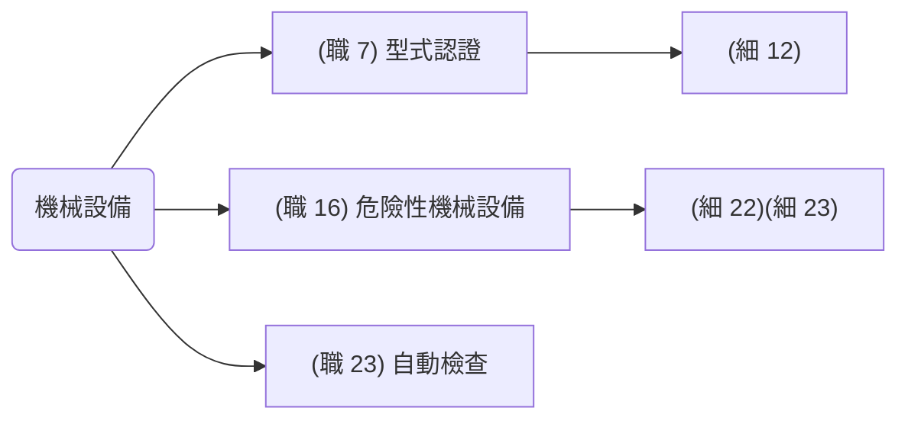
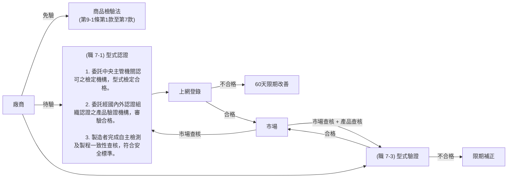

# 機械設備

[TOC]



## `型式認證` (職 7)(細 12)

- `製造者、輸入者、供應者或雇主`：非符合安全標準不得產製運出廠場、輸入、租賃、供應或設置。
- `製造者、輸入者`: 符合前項安全標準者於網站申報。

```text
(細 12)

1. 動力衝剪機械。(經中央主管機關認可之檢定機構實施`型式檢定`合格)
2. 手推刨床。
3. 木材加工用圓盤鋸。(經中央主管機關認可之檢定機構實施`型式檢定`合格)
4. 動力堆高機。
5. 研磨機。(經中央主管機關認可之檢定機構實施`型式檢定`合格)
6. 研磨輪。
7. 防爆電氣設備。(防爆燈具、防爆電動機、防爆開關箱：`型式檢定`)
8. 動力衝剪機械之光電式安全裝置。
9. 手推刨床之刃部接觸預防裝置。
10. 木材加工用圓盤鋸之反撥預防裝置及鋸齒接觸預防裝置。
11. 其他經中央主管機關指定公告者。
```

```text
(機械設備器具安全資訊申報登錄辦法 4)

 1. 委託經中央主管機關認可之檢定機構實施`型式檢定`合格。
 2. 委託經國內外認證組織認證之產品`驗證機構審驗`合格。
 3. 製造者完成自主檢測及產品製程一致性查核，確認符合安全標準。
```

## `型式驗證` (職 8)(職 9)

- `製造者、輸入者`: 非型式驗證合格不得產製運出廠場、輸入、租賃、供應或設置。

(勞職授字第 10702004912 號公告)
指定`交流電焊機用自動電擊防止裝置`列入職業安全衛生法第八條第一項之型式驗證設備

- 免驗證

  1. 依第十六條(危險性之機械或設備)或其他法律規定實施檢查、檢驗、驗證或認可。
  2. 供國防軍事用途使用，並有國防部或其直屬機關出具證明。
  3. 限量製造或輸入僅供科技研發、測試用途之專用機型，並經中央主管機關核准。
  4. 非供實際使用或作業用途之商業樣品或展覽品，並經中央主管機關核准。
  5. 其他特殊情形，有免驗證之必要，並經中央主管機關核准。

## 危險性機械

(職 16)(細 22)(危險性機械及設備安全檢查規則 3)

1. 固定式起重機：吊升荷重在三公噸以上之固定式起重機或一公噸以上之斯達卡式起重機。
2. 移動式起重機：吊升荷重在三公噸以上之移動式起重機。
3. 人字臂起重桿：吊升荷重在三公噸以上之人字臂起重桿。
4. 營建用升降機：設置於營建工地，供營造施工使用之升降機。
5. 營建用提升機：導軌或升降路高度在二十公尺以上之營建用提升機。
6. 吊籠：載人用吊籠。

## 危險性設備

(職 16)(細 23)(危險性機械及設備安全檢查規則 4)

| 設備種類         |              | 危險性設備                                           | 小型 特殊教育訓練                 |
| ---------------- | ------------ | ---------------------------------------------------- | --------------------------------- |
| 鍋爐             | (蒸氣鍋爐)   | $p>1kgf/cm^2$ 或 $HS>1m^2$                           | $p≤1kgf/cm^2$ 且 $0.5m^2≤HS≤1m^2$ |
|                  | (熱水鍋爐)   | $H>10m$ 或 $HS>8m^2$ ，且液體溫度超過 1 大氣壓之沸點 | $p≤1kgf/cm^2$ 且 $0.5m^2≤HS≤1m^2$ |
|                  | (熱媒鍋爐)   | $H>10m$ 或 $HS>8m^2$                                 |                                   |
|                  | (貫流式鍋爐) | $p>10kgf/cm^2$ 或 $HS>10m^2$                         | $p>10kgf/cm^2$ 且 $5m^2≤HS>10m^2$ |
| 第一種壓力容器   |              | $p>1kgf/cm^2$ 且 $V>0.2m^3$ $P*V>0.2$(內存蒸氣)      |                                   |
| 高壓氣體特定設備 |              | 指供高壓氣體之製造設備及其支持構造物，其 $P*V>0.04$  |                                   |
| 高壓氣體容器     |              | V≥500 公升(灌裝高壓氣體)                             |                                   |

p 壓力、HS 傳熱面積、H 水頭壓力

## 中央主管機關指定之機械

(職 7-1)(細則 12)中央主管機關指定之機械、設備或器具如下：

1. `動`力衝剪機械。
2. 手推`刨`床。
3. 木材加工用`圓`盤鋸。
4. 動力堆`高`機。
5. 研`磨`機。
6. 研磨`輪`。
7. 防爆`電`氣設備。
8. 動力衝剪機械之光`電`式安全裝置。
9. 手推刨床之刃部接觸預防裝置。
10. 木材加工用圓盤鋸之反撥預防裝置及鋸齒接觸預防裝置。
11. 其他經中央主管機關指定公告者。

```
動保圓高磨輪、電光刃具
```

## 商檢法


